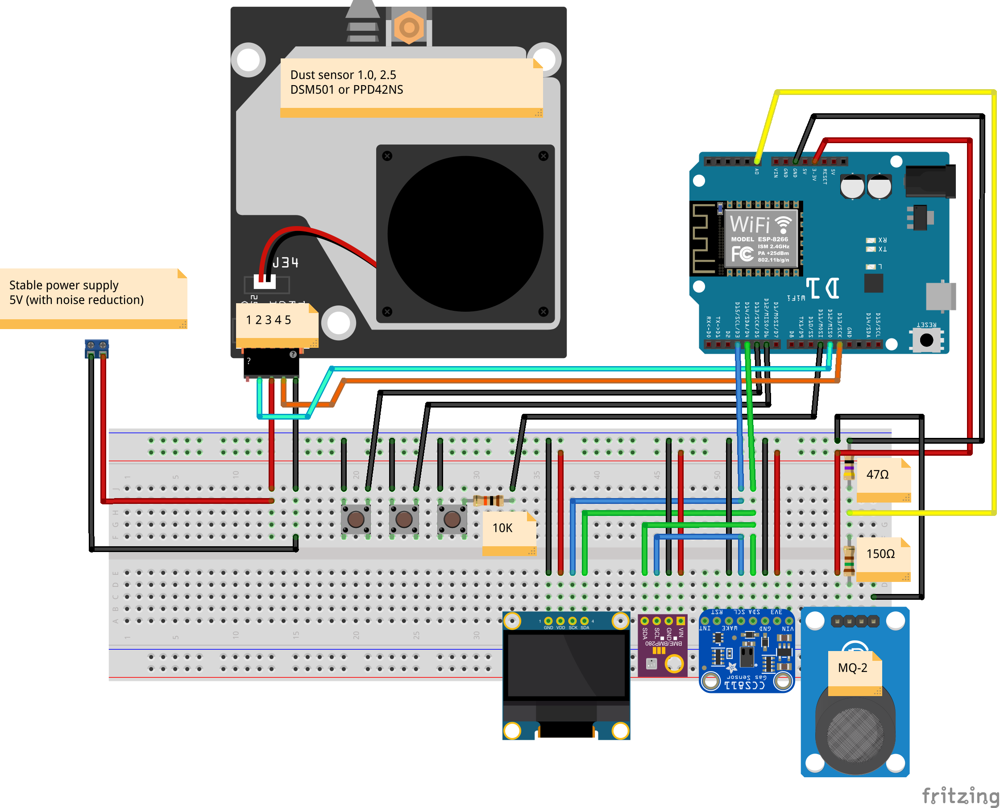

# MeteoStation
####work in progress
Meteo Station based on ESP8266

The station collects last 24h data, shows current info, builds 24h and a last hour carts.   

Collected data:
 
	- Temperature/Humidity/Pressure	
	- CO2/TVOC
	- AQI 1.0/2.5 Indexes
	- Flammable gas, smoke gas 
	
#####Example sum up general screen  
  
#####Example of 24hours charts 
   
#####Example of the last hour charts
  

#####Breadboard schema

